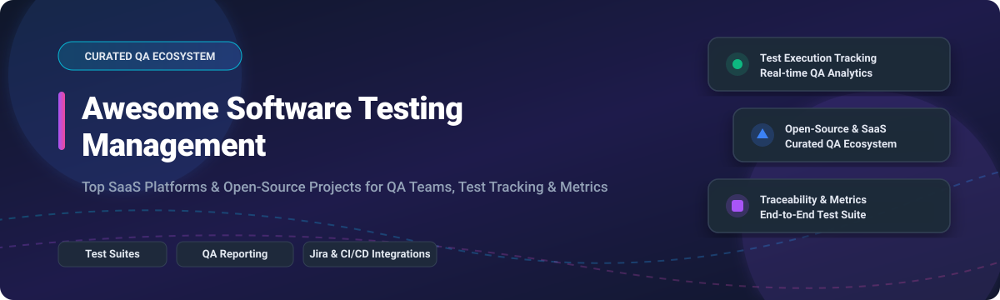

# 🧪 Awesome Software Testing Management 🚀

  
  
  
  

## 🌟 Top Software Testing Management Ecosystem & QA Tools

**Curated List of SaaS Products & Open-Source GitHub Projects for Test Case Organization, Execution Tracking & QA Reporting** 📈  
*Last updated: October 2026*

---

Welcome to the ultimate curated directory of **software testing management platforms**, **test case management systems (TCMS)**, and **QA reporting tools**! Whether you are a QA lead looking for enterprise SaaS platforms like TestRail and Azure Test Plans or an engineering team seeking self-hosted open-source solutions like Kiwi TCMS and TestLink, this repository provides deep comparative insights into pricing, free tier limits, company valuation, and GitHub star metrics. 🎯

---

## 📑 Table of Contents

- [📊 Market Overview & Industry Trends](#-market-overview--industry-trends)
- [☁️ SaaS / Hosted Test Management Platforms](#-saas--hosted-test-management-platforms)
- [🔓 Open-Source GitHub Projects](#-open-source-github-projects)
- [🤝 How to Contribute](#-how-to-contribute)
- [⚠️ Disclaimer](#%EF%B8%8F-disclaimer)
- [❤️ Support & Community](#%EF%B8%8F-support--community)
- [⭐ Star History](#-star-history)

---

## 📊 Market Overview & Industry Trends

> [!NOTE] 
> **Market Size & Structure**: The global **Software Testing & Test Management Market** is estimated at **$45 Billion to $50 Billion**, growing at a ~13-15% CAGR. 
> 
> **Market Fragmentation**: The sector is **moderately fragmented**, balancing hyper-scale cloud incumbents (Microsoft Azure DevOps) with specialized private-equity consolidators (SmartBear, Tricentis, Idera) and high-growth API-first startups (Qase, Testmo). Enterprise QA teams increasingly combine commercial Jira-native test management tools with open-source test runners and local-first AI test assistants.

---

## ☁️ SaaS / Hosted Test Management Platforms

Below is a detailed breakdown of top commercial SaaS software testing management tools, ranked by **Company Scale / Valuation (Descending)**.

| Platform 🚀 | Description & Features 📝 | Starting Price 💵 | Free Tier / Free Trial Limit 🎁 | Company Scale & Valuation 📈 |
| :--- | :--- | :--- | :--- | :--- |
| **[Azure Test Plans](https://azure.microsoft.com/en-us/products/devops/test-plans/)** | Enterprise manual & exploratory test planning built into Azure DevOps with complete requirement traceability. | **$52 / user / month** (Basic + Test Plans) | **30-day Free Trial** (Includes 5 free Basic users forever, but Test Plans requires subscription) | **Microsoft** (Market Cap: **~$3.2 Trillion+**) |
| **[qTest](https://www.tricentis.com/products/qtest-test-management/)** | Tricentis enterprise test management platform with deep Jira integration, automated test orchestration, and analytics. | **Quote-based** (~$50-$90 / user / month est.) | **14-day Free Trial** | **Tricentis** (Valuation: **$4.5 Billion**, ARR: ~$425M) |
| **[Zephyr](https://www.zephyr.com/)** | Popular Jira-native test management suite (Scale, Squad, Enterprise) for test case cycles and Atlassian reporting. | **$10 / month** (Flat for up to 10 Jira users) | **30-day Free Trial** (Free forever for Jira instances with ≤ 10 users) | **SmartBear** (Valuation: **~$3.0 Billion**) |
| **[TestRail](https://www.testrail.com/)** | The industry standard web-based test management platform for organizing test cases, runs, and Jira/CI integrations. | **$37 / user / month** (Professional plan) | **14-day Free Trial** | **Idera, Inc.** (Parent Valuation: **~$1.1B+**, TestRail ARR: ~$15M) |
| **[Xray](https://www.getxray.app/)** | Jira-native quality management tool supporting manual, automated, and exploratory tests with full requirement coverage. | **$10 / month** (Flat for up to 10 Jira users) | **30-day Free Trial** | **Idera, Inc.** (Product of Xblend / Idera group) |
| **[Qase](https://qase.io/)** | Modern API-first test management platform with clean UI, AI features, and seamless CI/CD test run reporting. | **$35 / user / month** (Teams plan) | **Free Forever Plan** (Up to 4 users, 2 projects, 512MB storage) | **Qase Inc.** (Est. Revenue: **~$5.6M**, $7.2M funding) |
| **[PractiTest](https://www.practitest.com/)** | Cloud QA management platform with AI insights, end-to-end traceability, and customizable audit reporting. | **$49 / user / month** (Team plan, min 5 users) | **14-day Free Trial** (No credit card required) | **PractiTest Ltd.** (Est. Revenue: **~$1.0M**) |
| **[SpiraTest](https://www.inflectra.com/SpiraTest/)** | Inflectra test management solution with requirements traceability, test execution, and compliance audit trails. | **~$43.66 / concurrent user / month** | **30-day Free Trial** | **Inflectra Corp.** (Private Mid-Market QA Vendor) |
| **[Testmo](https://www.testmo.com/)** | Modern unified test management tool for manual, automated, and exploratory testing with fast CI/CD execution tracking. | **$59 / month** (Team tier, includes up to 5 users) | **21-day Free Trial** | **Testmo GmbH** (Bootstrapped / Private QA Tech) |
| **[Kualitee](https://kualitee.com/)** | Cloud test management tool with AI-assisted test case generation, defect tracking, and mobile QA integrations. | **$12 / user / month** | **14-day Free Trial** | **Kualitee Inc.** (Private QA Tech) |

---

## 🔓 Open-Source GitHub Projects

Explore the top open-source software testing management tools, ranked by **GitHub_Stars (Descending)** ⭐️.

| Project & Repository 📦 | GitHub_Stars ⭐️ | Description & Highlights ⚡ |
| :--- | :--- | :--- |
| **[TestLink](https://github.com/TestLinkOpenSourceTRMS/testlink-code)** |  | **The veteran open-source test manager**, web-based requirements tracking, test suites, builds, and Jira/Bugzilla integrations. |
| **[Kiwi TCMS](https://github.com/kiwitcms/Kiwi)** |  | **The leading open-source TCMS**, IEEE 829 compatible, 2M+ Docker downloads, Python/Django framework, bug tracker integrations, & rich REST API. |
| **[UnitTCMS](https://github.com/kimatata/unittcms)** |  | **Modern self-hosted test case management system** with clean UI, role-based access control, folder hierarchies, and Docker deployment. |
| **[QualityFolio](https://github.com/opsfolio/qualityfolio)** |  | **Agile test management and quality tracking software** built for developer-centric teams requiring lightweight test organization. |
| **[TestPlanIt](https://github.com/TestPlanIt/testplanit)** |  | **Open-source test planning platform** for organizing manual test cases, creating execution runs, and generating team metrics. |
| **[Sherlock](https://github.com/leoGalani/sherlock)** |  | **Lightweight open-source test management tool** focusing on simplicity and quick manual test execution tracking. |
| **[SuiTest](https://github.com/suiflex/suitest)** |  | **Flexible test suite & test case management engine** providing structured test execution logging and web interface. |
| **[Testomatio Open App](https://github.com/testomatio/app)** |  | **Modern test management platform core** designed to synchronize automated tests with manual test case management. |
| **[OpenTMI](https://github.com/OpenTMI/opentmi)** |  | **Open Test Management Infrastructure**, telemetry-focused test result storage engine with REST API and web dashboard. |
| **[Tesbo Test Manager](https://github.com/QAbleHQ/Tesbo-Test-Manager)** |  | **Web-based open-source test manager** by QAble for managing test suites, test runs, and test failure analysis. |
| **[QA Studio](https://github.com/QAStudio-Dev/studio)** |  | **Fast, modern SvelteKit 5 test management tool** with PostgreSQL, rich media attachment support, and full REST API. |
| **[Gwirian](https://github.com/TheAcmada/gwirian)** |  | **BDD-focused test scenario management platform** built on Rails 8, Tailwind, htmx, with AI assistant MCP integration. |
| **[QuAck / Dokimion](https://github.com/sillstest/dokimion)** |  | **Dynamic tree test management system** where test case hierarchies build dynamically from custom test attributes. |
| **[BASIL](https://github.com/kartben/BASIL)** |  | **Software quality management tool** providing strict specification-to-code traceability and SPDX SBOM export. |

---

## 🤝 How to Contribute

Contributions are warmly welcomed! Help keep this software testing management directory updated and comprehensive. 🛠️

1. **Fork** the repository 🍴
2. **Add or update** entries in `README.md` following the table structures above.
3. Make sure to include factual pricing, free tier limits, or repository Stars_Counts.
4. **Submit a Pull Request** with a brief summary of changes.

Check out [Awesome-Awesome-Awesome](https://github.com/ishandutta2007/Awesome-Awesome-Awesome) for more awesome developer lists! 🌟

---

## ⚠️ Disclaimer

- This list is **community-curated** for informational and educational purposes.
- Software pricing, valuation, and free tier terms are subject to change by vendors.
- Self-hosted open-source software testing managers handle sensitive product quality data and require proper infrastructure hardening.

---

## ❤️ Support & Community

Thank you for exploring **Awesome Software Testing Management**! 💖 If this repository helped you find the right QA tool or TCMS platform for your project, please consider supporting the project:

- ⭐️ **Star this repository** to show your appreciation!
- 🔀 **Fork & Share** it with your QA colleagues, DevOps teammates, and software testing groups.
- ☕ **Sponsor / Buy me a coffee**: If you enjoy my open-source projects, you can support my work directly via the [GitHub Sponsors Dashboard](https://github.com/sponsors/ishandutta2007).

---

## ⭐ Star History

---

  <i>Made with ❤️ for QA Engineers, Software Testers, and Quality Managers worldwide.</i>

